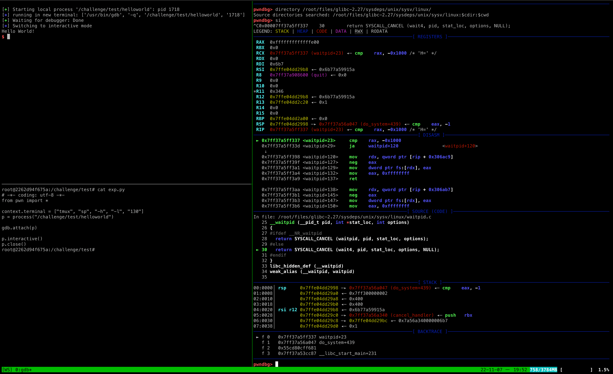

# pwn-env-docker

一键搭建调试 pwn 题的 docker 环境。

题目放在 `./challenge` 目录中，通过 docker-compose 启动时，该目录会被映射到容器中的 `/challenge` 目录。

不同容器之间共享工作目录，方便切换环境。

## 使用说明

### 下载仓库

```sh
git clone --recursive https://github.com/the-soloist/pwn-env-docker
```

### 安装依赖

```sh
cd /path/to/pwn-env-docker
bash ./setup.sh
```

### 更新工具

```sh
git pull && bash ./setup.sh
```

### 启动/关闭容器

本项目提供了两种构建方式：

1. 本地构建
2. 拉取 docker hub 镜像构建

#### Docker Hub 镜像构建

~~docker hub 中仅上传了几个常用的版本~~（目前已上传[docker-compose.yml](./docker-compose.yml)里的所有版本）

由于部分插件是使用 volumes 进行映射的，所以拉取镜像前需要执行 `setup.sh` 脚本安装依赖

```sh
docker compose up -d <service-name>
```

#### 本地构建

```sh
docker compose -f docker-compose-dev.yml up -d <service-name>
```

#### 更新容器

更新 docker hub 镜像

```sh
docker compose pull <service-name>
```

本地构建可以使用 build 命令

```sh
docker compose -f docker-compose-dev.yml build <service-name>
```

### 容器信息

#### 系统信息

| 镜像                      | 系统版本     | libc 版本 | ssh 端口映射 | xinetd 端口映射 |
| ------------------------- | ------------ | --------- | ------------ | --------------- |
| th3s/pwn-env:ubuntu-16.04 | Ubuntu 16.04 | 2.23      | 21604 -> 22  | 61604 -> 8888   |
| th3s/pwn-env:ubuntu-17.04 | Ubuntu 17.04 | 2.24      | 21704 -> 22  | 61704 -> 8888   |
| th3s/pwn-env:ubuntu-17.10 | Ubuntu 17.10 | 2.26      | 21710 -> 22  | 61710 -> 8888   |
| th3s/pwn-env:ubuntu-18.04 | Ubuntu 18.04 | 2.27      | 21804 -> 22  | 61804 -> 8888   |
| th3s/pwn-env:ubuntu-18.10 | Ubuntu 18.10 | 2.28      | 21810 -> 22  | 61810 -> 8888   |
| th3s/pwn-env:ubuntu-19.04 | Ubuntu 19.04 | 2.29      | 21904 -> 22  | 61904 -> 8888   |
| th3s/pwn-env:ubuntu-19.10 | Ubuntu 19.10 | 2.30      | 21910 -> 22  | 61910 -> 8888   |
| th3s/pwn-env:ubuntu-20.04 | Ubuntu 20.04 | 2.31      | 22004 -> 22  | 62004 -> 8888   |
| th3s/pwn-env:ubuntu-20.10 | Ubuntu 20.10 | 2.32      | 22010 -> 22  | 62010 -> 8888   |
| th3s/pwn-env:ubuntu-21.04 | Ubuntu 21.04 | 2.33      | 22104 -> 22  | 62104 -> 8888   |
| th3s/pwn-env:ubuntu-22.04 | Ubuntu 22.04 | 2.35      | 22204 -> 22  | 62204 -> 8888   |
| th3s/pwn-env:ubuntu-22.10 | Ubuntu 22.10 | 2.36      | 22210 -> 22  | 62210 -> 8888   |
| th3s/pwn-env:ubuntu-23.04 | Ubuntu 23.04 | 2.37      | 22304 -> 22  | 62304 -> 8888   |
| th3s/pwn-env:ubuntu-23.10 | Ubuntu 23.10 | 2.38      | 22310 -> 22  | 62310 -> 8888   |

#### compose volumes 映射

| 宿主机路径  | 容器路径      | 备注                 |
| ----------- | ------------- | -------------------- |
| ./challenge | /challenge    | CTF 题目路径         |
| ./config    | /root/.config | 配置文件路径         |
| ./deps      | /deps         | 自定义工具的依赖路径 |
| ./ssh       | /root/.ssh    | SSH 密钥路径         |

### 配置容器

#### SSH 登录

SSH 配置中已经打开了`PermitRootLogin`，由于没有设置密码，所以默认只能通过密钥登录

```sh
ssh-keygen -b 4096
docker cp $HOME/.ssh/id_rsa.pub <container-id>:/root/.ssh/authorized_keys
ssh root@<ip> -p <port>
```

或者将本地的 key 复制到容器中，用于远程连接

```sh
docker cp $HOME/.ssh/authorized_keys <container-id>:/root/.ssh/authorized_keys
```

如果是通过 docker-compose 启动，也可以修改 ./ssh 目录下的 authorized_keys 文件

```sh
vim ./ssh/authorized_keys
```

#### 模拟题目环境

```sh
cd /root/scripts/xinetd
vim xinetd.conf
bash ./xinetd.sh
```

## 容器默认配置

### 用户组

- pwn（用于模拟题目环境）
- root

### 工具包

部分非 LTS 版本由于存在 bug 可能未安装某些工具

- python3、pip3、ruby
- gdb、socat、ssh server
- wget、curl、vim、tmux
- one_gadget、seccomp-tools
- glibc 源码（位于 `/root/files/glibc-<version>`）
- 部分常用依赖

常用工具：

- https://github.com/matrix1001/glibc-all-in-one
- https://github.com/lieanu/LibcSearcher
- https://github.com/NixOS/patchelf

### 工具默认配置

- python
  - 已安装：angr、gmpy2、pwntools、pycryptodome、z3 等（包含常用 python 库）
  - pip 默认源：https://pypi.tuna.tsinghua.edu.cn/simple
- gdb
  - 默认加载插件：Pwngdb
  - 手动加载插件：peda、gef、pwndbg
    - 对应启动命令：gdb-peda、gdb-gef、gdb-pwndbg
- tmux
  - 插件：tmux-mem-cpu-load、tmux-prefix-highlight、tmux-sensible、tmux-sidebar、tmux-yank、tpm
  - 主题：（需要手动修改启动参数）
    - 添加 [dracula](https://github.com/dracula/tmux) 主题配置
  - 配置：
    - 默认 prefix 为 C-x
- gem
  - 默认源：https://gems.ruby-china.com
- apt
  - 默认源：http://mirrors.tuna.tsinghua.edu.cn

## 使用截图

2 核 4G 云服务器搭建耗时，时间比较长建议提前 build 镜像


tmux 分屏与 gdb 带源码调试


