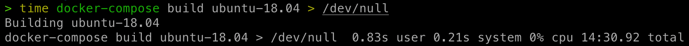

# pwn-env-docker

快速搭建调试 pwn 题的 docker 环境。

题目放在 `./challenge` 目录中，通过 docker-compose 启动时，该目录会被映射到容器中的 `/challenge` 目录。

## 使用说明

### 下载仓库

```sh
git clone --recursive https://github.com/the-soloist/pwn-env-docker
```

### 安装依赖

```sh
bash ./setup.sh
```

### 启动/关闭容器

```sh
docker-compose up --build <service-name>
docker-compose down
```

### 容器环境信息

| 镜像                 | 系统版本     | libc 版本 | ssh 端口映射 | xinetd 端口映射 |
| -------------------- | ------------ | --------- | ------------ | --------------- |
| pwn-env/ubuntu-16.04 | Ubuntu 16.04 | 2.23      | 22160 -> 22  | 61604 -> 8888   |
| pwn-env/ubuntu-17.04 | Ubuntu 17.04 | 2.24      | 22170 -> 22  | 61704 -> 8888   |
| pwn-env/ubuntu-17.10 | Ubuntu 17.10 | 2.26      | 22171 -> 22  | 61710 -> 8888   |
| pwn-env/ubuntu-18.04 | Ubuntu 18.04 | 2.27      | 22180 -> 22  | 61804 -> 8888   |
| pwn-env/ubuntu-18.10 | Ubuntu 18.10 | 2.28      | 22181 -> 22  | 61810 -> 8888   |
| pwn-env/ubuntu-19.04 | Ubuntu 19.04 | 2.29      | 22190 -> 22  | 61904 -> 8888   |
| pwn-env/ubuntu-19.10 | Ubuntu 19.10 | 2.30      | 22191 -> 22  | 61910 -> 8888   |
| pwn-env/ubuntu-20.04 | Ubuntu 20.04 | 2.31      | 22200 -> 22  | 62004 -> 8888   |
| pwn-env/ubuntu-20.10 | Ubuntu 20.10 | 2.32      | 22201 -> 22  | 62010 -> 8888   |
| pwn-env/ubuntu-21.04 | Ubuntu 21.04 | 2.33      | 22210 -> 22  | 62104 -> 8888   |
| pwn-env/ubuntu-22.04 | Ubuntu 22.04 | 2.34      | 22220 -> 22  | 62204 -> 8888   |
| pwn-env/ubuntu-22.10 | Ubuntu 22.10 | 2.36      | 22221 -> 22  | 62210 -> 8888   |

### ssh 登录

默认没有设置 root 的密码，只能通过密钥登录

```sh
ssh-keygen -b 4096
docker cp $HOME/.ssh/id_rsa.pub <container-id>:/root/.ssh/authorized_keys
ssh root@127.0.0.1 -p <port>
```

或者将本地的 key 复制到容器中，用于远程连接

```sh
docker cp $HOME/.ssh/authorized_keys <container-id>:/root/.ssh/authorized_keys
```

如果是通过 docker-compose 启动，也可以修改 ./ssh 目录下的 authorized_keys 文件

### xinetd 启动

```sh
cd /root/scripts/xinetd
vim xinetd.conf
bash ./xinetd.sh
```

## 工具包

- python3、pip3
- gdb、one_gadget、seccomp-tools
- vim、tmux、socat
- glibc 源码（位于 `/root/files/glibc-<version>`）

## 默认配置

- gdb
  - 插件：peda、gef、pwndbg、Pwngdb
  - 插件对应启动命令：gdb-gef、gdb-peda、gdb-pwndbg
- tmux
  - 插件：
    - tmux-mem-cpu-load
    - tmux-prefix-highlight
    - tmux-sensible
    - tmux-sidebar
    - tmux-yank
    - tpm
  - 配置：
    - 默认 prefix 为 C-x
- pip
  - 默认源：https://pypi.tuna.tsinghua.edu.cn/simple
- gem
  - 默认源：https://gems.ruby-china.com
- apt
  - 默认源：http://mirrors.tuna.tsinghua.edu.cn

## 使用截图

2 核 4G 云服务器搭建耗时，时间比较长建议提前 build 镜像



tmux 分屏与 gdb 带源码调试


